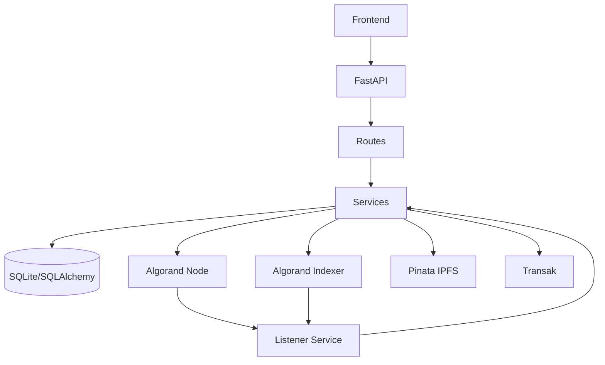

## FanForge Backend Audit & Expansion Plan

### 1. Executive Summary (Target End-State)

- **Goal**: Deliver a production-hardened backend that securely supports tipping, Butki loyalty badges, Bauni memberships with expiry, Shawty utility tokens, and a future-proof merch/discount system, all via clean, frontend-ready APIs.
- **Current health (from exploration)**: Solid foundational architecture and domain modeling; key gaps in wallet auth security, on-chain NFT controller integration, merch/discount flows, membership gating usage, and automated tests.
- **Target rating**: Move from an estimated **6.5/10** (prototype+) to **9/10** production readiness via the steps below, without breaking demo flows.

---

### 2. Architecture & Structural Improvements (Phase 1)

#### 2.1 Confirm and tighten layering

- **Files**: [backend/main.py](backend/main.py), [backend/routes/*.py](backend/routes), [backend/services/*.py](backend/services), [backend/db_models.py](backend/db_models.py), [backend/config.py](backend/config.py).
- **Actions**:
  - **2.1.1 Enforce clear boundaries**:
    - Keep all Algorand/Pinata calls in services (`transaction_service`, `contract_service`, `nft_service`, `ipfs_service`, `transak_service`, `listener_service`).
    - Ensure routes call only services and models, not low-level SDKs directly; refactor any direct SDK usage in routes into services.
  - **2.1.2 Centralize shared dependencies**:
    - Introduce `backend/deps.py` for reusable FastAPI dependencies (e.g., DB session, `require_wallet_auth`, `require_bauni_membership`, pagination params) and import from there in routers.
  - **2.1.3 Detect circular imports**:
    - Use `SemanticSearch`/code review to identify any cycles (e.g., services importing routers or vice versa).
    - Where needed, move shared constants (e.g., NFT class strings, tip thresholds) into `backend/domain/constants.py` to break cycles.

#### 2.2 Standardize project layout and naming

- **Files**: [backend/routes](backend/routes), [backend/services](backend/services), [backend/contracts](backend/contracts).
- **Actions**:
  - **2.2.1 Group feature modules**:
    - Ensure Butki/Bauni/Shawty each have aligned `routes/*_service.py` and any shared helpers in `services/nft_service.py` and `domain/constants.py`.
  - **2.2.2 Introduce a `domain` package**:
    - Add `backend/domain/__init__.py` and modules like `constants.py`, `enums.py`, and `errors.py` (domain-specific error types) used by services and routers.

#### 2.3 Dead code and tech-debt cleanup

- **Files**: [backend/contracts/nft_controller](backend/contracts/nft_controller), [backend/scripts](backend/scripts).
- **Actions**:
  - **2.3.1 Classify `nft_controller` usage**:
    - Decide between: (A) fully integrating `nft_controller` into flows, or (B) clearly marking it as experimental and keeping logic off-chain.
    - For this iteration, prefer **A light integration path**: use `nft_controller` only for on-chain Shawty burn checks and Bauni membership verification, but keep DB as source of truth to avoid migration risk.
  - **2.3.2 Mark scripts and legacy code**:
    - Annotate legacy demo/test scripts in `scripts/` with clear comments and keep them from being imported anywhere in app runtime.

#### 2.4 Production guards

- **Files**: [backend/config.py](backend/config.py), [backend/main.py](backend/main.py).
- **Actions**:
  - Ensure `Settings.validate_production_settings()` is called once at startup and that any new simulation/demo endpoints are guarded by `environment != "production"` and `simulation_mode` flags.

#### 2.5 High-level architecture diagram (for documentation)

- Add to docs (or README) a simple component diagram using Mermaid:

---

### 3. Security Hardening Plan (Phase 2)

#### 3.1 Wallet authentication upgrade

- **Files**: [backend/middleware/auth.py](backend/middleware/auth.py), [backend/routes/*](backend/routes).
- **Actions**:
  - **3.1.1 Implement signature-based login**:
    - Add endpoints in a new `routes/auth.py`:
      - `POST /auth/challenge` – returns a nonce tied to a wallet address and short TTL (stored in `AuthChallenge` table).
      - `POST /auth/verify` – accepts `{wallet, signed_message}`; verifies Ed25519 signature against nonce; issues short-lived JWT (or opaque session token) containing wallet and role.
    - Add `AuthChallenge` model to `db_models.py` with `wallet`, `nonce`, `expires_at`, `used`.
  - **3.1.2 Replace `require_wallet_auth`**:
    - Deprecate header equality check; introduce `require_authenticated_wallet` dependency that reads token from `Authorization: Bearer` and verifies.
    - Add stricter variants for creators and fans (`require_creator`, `require_fan`) checking `User.role`.
  - **3.1.3 Apply to sensitive endpoints**:
    - Creator contract endpoints (`register`, `upgrade`, `pause`, `unpause`, dashboard, template management).
    - Shawty burn/lock/transfer endpoints.
    - Bauni membership verification and any future merch checkout.

#### 3.2 Role-based authorization checks

- **Files**: [backend/db_models.py](backend/db_models.py), [backend/routes/creator.py](backend/routes/creator.py), [backend/routes/fan.py](backend/routes/fan.py), [backend/routes/shawty.py](backend/routes/shawty.py), [backend/routes/bauni.py](backend/routes/bauni.py).
- **Actions**:
  - Ensure a `User` row exists for any wallet invoking creator routes; enforce `role == "creator"` where appropriate.
  - For Shawty redemption endpoints, enforce that `fan_wallet` in DB matches the authenticated wallet.

#### 3.3 Rate limiting & abuse protections

- **Files**: [backend/middleware/rate_limit.py](backend/middleware/rate_limit.py), [backend/main.py](backend/main.py).
- **Actions**:
  - Confirm rate limiting applied to:
    - Auth challenge/verify.
    - Creator registration and contract upgrade endpoints.
    - Simulation endpoints and high-risk NFT mints.
  - Add configurable limits via `Settings` and centralize decorator/`Depends` usage.

#### 3.4 CORS, headers, and error exposure

- **Files**: [backend/main.py](backend/main.py), [backend/config.py](backend/config.py).
- **Actions**:
  - Verify CORS origins are exact matches in production; ensure allowed headers include `Authorization` and custom wallet headers if still used.
  - Ensure global exception handler masks internal errors but logs enough detail for debugging.

#### 3.5 Secret and environment handling

- **Files**: [backend/config.py](backend/config.py).
- **Actions**:
  - Confirm no secrets are logged (especially `platform_mnemonic`, Transak, Pinata keys) and mask them in logs.
  - Ensure `.env` loading is explicit in local/dev but not committed.

---

### 4. Business Logic Validation & Hardening (Phase 3)

#### 4.1 Tip → Transaction → Listener → NFT flow

- **Files**: [backend/contracts/tip_proxy/contract.py](backend/contracts/tip_proxy/contract.py), [backend/services/listener_service.py](backend/services/listener_service.py), [backend/db_models.py](backend/db_models.py).
- **Actions**:
  - **4.1.1 Enforce single-source tip event ingestion**:
    - Confirm all tipping uses TipProxy logs; add assertions to listener to skip non-TipProxy app IDs.
  - **4.1.2 Idempotency for `Transaction` rows**:
    - Enforce unique constraint on `tx_id` in `Transaction` model and catch integrity errors gracefully.
    - Mark `processed` only after downstream Butki/Bauni/Shawty actions succeed.

#### 4.2 Butki loyalty flow

- **Files**: [backend/services/butki_service.py](backend/services/butki_service.py), [backend/services/listener_service.py](backend/services/listener_service.py), [backend/db_models.py](backend/db_models.py).
- **Actions**:
  - Ensure tip counting uses atomic DB updates (e.g., `UPDATE ... SET tip_count = tip_count + 1` with proper transaction scope) to avoid race conditions.
  - Enforce minting-only-on-threshold-crossing logic (e.g., badge per 5th tip) with a clear condition that avoids duplicate mints if retries occur.

#### 4.3 Bauni membership activation & expiry

- **Files**: [backend/services/bauni_service.py](backend/services/bauni_service.py), [backend/services/listener_service.py](backend/services/listener_service.py), [backend/db_models.py](backend/db_models.py).
- **Actions**:
  - Verify membership creation/renewal logic sets `expires_at = now + validity_days` and properly deactivates previous membership row or updates in-place.
  - Ensure `verify_membership` checks `now < expires_at` and `is_active` and is used consistently.
  - Add a periodic cleanup (or listener hook) to mark memberships as inactive once expired.

#### 4.4 Shawty mint logic & token semantics

- **Files**: [backend/services/shawty_service.py](backend/services/shawty_service.py), [backend/services/listener_service.py](backend/services/listener_service.py), [backend/db_models.py](backend/db_models.py).
- **Actions**:
  - Validate that Shawty mints occur only once per qualifying payment and that retries cannot double-mint (via unique constraint on `purchase_tx_id` for `ShawtyToken`).
  - Ensure `is_burned` and `is_locked` transitions are mutually exclusive and enforced.

#### 4.5 Idempotent transaction submission

- **Files**: [backend/services/transaction_service.py](backend/services/transaction_service.py).
- **Actions**:
  - Wrap `submit_single` and `submit_group` with optional idempotency keys (e.g., client-submitted `X-Idempotency-Key`) backed by DB table `SubmittedTransaction` storing hash and status.
  - Improve error parsing to classify network, logic, and duplicate errors for better client responses.

---

### 5. Merch & Discount System Design (Phase 4)

#### 5.1 New database models

- **File**: [backend/db_models.py](backend/db_models.py).
- **Actions**:
  - Add `Product` model:
    - Fields: `id`, `creator_wallet` (FK to `User`), `slug`, `name`, `description`, `image_ipfs_hash`, `price_algo`, `currency` (default ALGO), `max_per_order`, `stock_quantity` (nullable for unlimited), `active`, timestamps.
  - Add `DiscountRule` model:
    - Fields: `id`, `creator_wallet`, `product_id` (nullable for global), `discount_type` (`PERCENT`, `FIXED_ALGO`), `value`, `min_shawty_tokens`, `requires_bauni` (bool), `max_uses_per_wallet`, `active`.
  - Add `Order` and `OrderItem` models:
    - `Order`: `id`, `fan_wallet`, `creator_wallet`, `status` (`PENDING_PAYMENT`, `PAID`, `CANCELLED`), `total_algo`, `discount_algo`, `shawty_asset_ids_used` (JSON), `bauni_membership_id` (nullable), `tx_id` (Algorand payment), timestamps.
    - `OrderItem`: `id`, `order_id`, `product_id`, `quantity`, `unit_price_algo`, `discount_algo`.

#### 5.2 Merch service layer

- **File**: new [backend/services/merch_service.py](backend/services/merch_service.py).
- **Responsibilities**:
  - CRUD for `Product` (create/update/soft-delete) for creators.
  - Query products (with pagination and filtering) for fans.
  - Build checkout quotes:
    - Given `{fan_wallet, creator_wallet, cart_items, shawty_assets?, apply_bauni?}`, compute `subtotal`, `discount`, `total`, using `DiscountRule`, Shawty, and Bauni status.
  - Confirm payments and mark orders as `PAID` after `Transaction` row + TipProxy payment is detected.

#### 5.3 Merch & discount endpoints

- **File**: new [backend/routes/merch.py](backend/routes/merch.py).
- **Endpoints**:
  - Creator-side (auth: `require_creator`):
    - `POST /creator/{wallet}/products` – create product.
    - `GET /creator/{wallet}/products` – list products.
    - `PATCH /creator/{wallet}/products/{product_id}` – update.
    - `DELETE /creator/{wallet}/products/{product_id}` – soft-delete.
    - `POST /creator/{wallet}/discounts` – create discount rules.
    - `GET /creator/{wallet}/discounts` – list rules.
  - Fan-side:
    - `GET /creator/{wallet}/store` – public product catalog (paginated).
    - `POST /creator/{wallet}/store/quote` – compute a merch quote using Shawty and Bauni (no side effects).
    - `POST /creator/{wallet}/store/order` – create a pending order and return unsigned TipProxy payment group for front-end to sign.
    - `GET /fan/{wallet}/orders` – view order history.

#### 5.4 Shawty integration for discounts

- **Files**: [backend/services/shawty_service.py](backend/services/shawty_service.py), [backend/services/merch_service.py](backend/services/merch_service.py).
- **Actions**:
  - Use `shawty_service.validate_token` in merch quote endpoint to ensure supplied Shawty tokens are:
    - Owned by the fan.
    - Not already burned or locked.
    - Within allowed redemption rules.
  - For successful checkout:
    - Call `shawty_service.lock_for_discount` or `burn_for_merch` to record redemption and prevent re-use.

#### 5.5 Membership gating for merch and content

- **Files**: [backend/routes/bauni.py](backend/routes/bauni.py), [backend/services/bauni_service.py](backend/services/bauni_service.py), [backend/routes/merch.py](backend/routes/merch.py).
- **Actions**:
  - Use `require_bauni_membership` as dependency on:
    - Member-only merch offers (e.g., `/creator/{wallet}/store/members-only`).
    - Future `routes/content.py` for member-only content endpoints.

---

### 6. Frontend Readiness & API Consistency (Phase 5)

#### 6.1 Standard response envelope

- **Files**: [backend/main.py](backend/main.py), [backend/routes/*](backend/routes), [backend/domain/errors.py](backend/domain/errors.py).
- **Actions**:
  - Define a standard response schema, e.g.:
    - Success: `{ "success": true, "data": <payload>, "meta": { ... } }`.
    - Error: `{ "success": false, "error": { "code": "...", "message": "...", "details": {...} } }`.
  - Create helper functions or response models used by all routers to enforce consistency.

#### 6.2 HTTP status codes and error mapping

- **Files**: [backend/routes/](backend/routes)*, [backend/domain/errors.py](backend/domain/errors.py).
- **Actions**:
  - Introduce custom exceptions (e.g., `NotFoundError`, `ValidationError`, `PermissionDeniedError`, `RateLimitError`, `BlockchainError`) and a central exception handler mapping them to HTTP statuses.
  - Audit each router to ensure:
    - 200/201 for success.
    - 400 for validation issues.
    - 401/403 for auth issues.
    - 404 for missing resources.
    - 409 for conflict (e.g., double-mint attempts).

#### 6.3 Pagination and filtering

- **Files**: [backend/routes/fan.py](backend/routes/fan.py), [backend/routes/nft.py](backend/routes/nft.py), [backend/routes/merch.py](backend/routes/merch.py).
- **Actions**:
  - Introduce a standard pagination dependency (`limit`, `cursor`/`offset`) and response meta format.
  - Apply to:
    - NFT inventory endpoints.
    - Fan tip history and leaderboards.
    - Product store listing and order history.

---

### 7. Database Integrity & Performance (Phase 6)

#### 7.1 Schema validations and constraints

- **File**: [backend/db_models.py](backend/db_models.py).
- **Actions**:
  - Add/confirm:
    - Unique constraint on `Transaction.tx_id`.
    - Unique constraint on `ShawtyToken.purchase_tx_id`.
    - Unique constraint on `Membership.asset_id` and `(fan_wallet, creator_wallet, is_active)`.
  - Add `Index` definitions on frequently filtered columns (e.g., `Transaction.creator_wallet`, `Transaction.fan_wallet`, `NFT.owner_wallet`, `Membership.fan_wallet`, `Membership.creator_wallet`).

#### 7.2 Transaction boundaries

- **Files**: [backend/services/*_service.py](backend/services), [backend/database.py](backend/database.py).
- **Actions**:
  - Ensure each high-level operation (e.g., a tip causing a Bauni mint) is wrapped in a single DB transaction so that `Transaction.processed`, `NFT`, `Membership`, and `FanLoyalty` changes commit atomically.

#### 7.3 Query optimization

- **Files**: [backend/routes/fan.py](backend/routes/fan.py), [backend/routes/creator.py](backend/routes/creator.py), [backend/routes/butki.py](backend/routes/butki.py).
- **Actions**:
  - Review leaderboards and dashboards for N+1 queries; convert to aggregate SQL queries with joins and `GROUP BY` instead of per-row loops.

---

### 8. Performance & Scalability (Phase 7)

#### 8.1 Async correctness & blocking operations

- **Files**: [backend/services/](backend/services)*, [backend/listener_service.py](backend/services/listener_service.py).
- **Actions**:
  - Ensure all Algorand and IPFS calls are truly async or offloaded to thread pool executors.
  - Identify any blocking loops in listener; offload heavy NFT minting to background tasks (e.g., via an internal task queue abstraction that can later be backed by Redis/Celery).

#### 8.2 Listener throughput and resilience

- **Files**: [backend/services/listener_service.py](backend/services/listener_service.py).
- **Actions**:
  - Add metrics (even simple log-based counters) for:
    - Tips processed per minute.
    - Failed mints and retry counts.
    - Listener lag (current round vs last processed round).
  - Improve retry strategy with exponential backoff and clearer classification of transient vs permanent errors.

#### 8.3 Caching and repeated calls

- **Files**: [backend/services/contract_service.py](backend/services/contract_service.py), [backend/services/nft_service.py](backend/services/nft_service.py).
- **Actions**:
  - Cache compiled TEAL binaries and template metadata where safe.
  - Avoid re-querying contract global state in tight loops; use batched reads or cached snapshots when building dashboards.

---

### 9. Testability & CI Strategy (Phase 8)

#### 9.1 Rebuild automated tests

- **Files**: new `backend/tests/` suite.
- **Actions**:
  - Introduce pytest-based tests with categories:
    - Unit tests for services (Butki, Bauni, Shawty, merch, auth) using fakes/mocks for Algorand/Pinata.
    - Integration tests spinning up FastAPI app with in-memory SQLite and stubbed Algorand client.
  - Reframe `scripts/test_demo_flow.py` as an integration test that calls HTTP endpoints end-to-end instead of invoking services directly.

#### 9.2 Edge case simulations

- **Files**: `backend/tests/test_membership_expiry.py`, `backend/tests/test_double_tip.py`, `backend/tests/test_discount_usage.py`, etc.
- **Actions**:
  - Write tests to simulate:
    - Expired membership and gating denial.
    - Double tip with same `tx_id` to assert idempotency.
    - Shawty discount re-use attempts (must fail on second attempt).
    - Shawty transfer edge cases and burning/locking rules.

#### 9.3 Local dev utilities

- **Files**: [backend/scripts/test_demo_flow.py](backend/scripts/test_demo_flow.py) and possibly new scripts.
- **Actions**:
  - Keep demo scripts but update them to run through public HTTP APIs where feasible to match real-world flows.

---

### 10. Categorized Issues & Remaining Risks (For Implementation)

#### 10.1 Critical (to address first)

- Weak wallet authentication (`require_wallet_auth` header equality) and inconsistent enforcement on creator and Shawty endpoints.
- Lack of idempotency on transaction ingestion and NFT minting (risk of double-mint under retries).
- Missing merch and real discount flows despite Shawty/Butki/Bauni modeling.

#### 10.2 High

- Unused `nft_controller` smart contract causing divergence between on-chain and off-chain business rules.
- Limited rate limiting and protection on new auth and merch endpoints (once added).
- Listener resilience and scaling (single process, no queue).

#### 10.3 Medium

- Inconsistent response formats and status codes across routers.
- Missing DB indexes for high-traffic queries and leaderboards.
- Lack of formal tests for membership expiry, discount application, and edge cases.

#### 10.4 Low

- Demo/testing scripts tightly coupled to services instead of HTTP APIs.
- Incomplete documentation of flows for frontend teams.

---

### 11. Implementation Ordering

1. **Security foundation**: Implement proper auth, role checks, and idempotent transaction handling.
2. **Business logic hardening**: Lock down Butki/Bauni/Shawty flows, membership expiry, and listener idempotency.
3. **Merch & discount system**: Add `Product`, `Order`, `DiscountRule` models, merch service and routes, and integrate Shawty/Bauni.
4. **API standardization**: Normalize response envelopes, status codes, and pagination.
5. **DB & performance**: Add constraints, indexes, and optimize hot queries; improve listener resilience.
6. **Tests & tooling**: Build a layered test suite and convert demo flow into HTTP-driven integration tests.

Following this sequence gives you a secure, feature-complete backend ready to support a rich Web3 Patreon experience and a future React/Next.js frontend.

